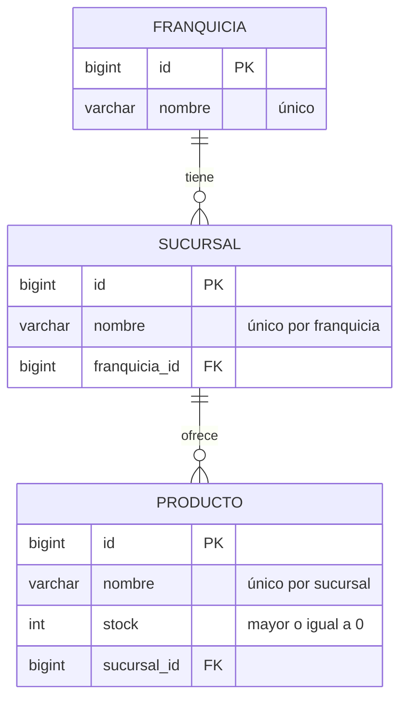

# API de Franquicias

API REST para administrar franquicias, sus sucursales y los productos que ofrece cada sucursal, con control de stock.

Permite crear y renombrar franquicias, sucursales y productos, eliminar productos, actualizar el stock y consultar el producto con mayor stock de cada sucursal de una franquicia.

## Tecnologías

- **Java 21**
- **Spring Boot 4** (Web MVC, Data JPA, Validation)
- **MySQL 8.4**
- **Flyway** para las migraciones de la base de datos
- **JUnit 5, Mockito y MockMvc** para las pruebas
- **Docker y Docker Compose** para la ejecución local
- **Terraform** para aprovisionar la base de datos en AWS (RDS)

## Modelo de datos

Una franquicia tiene varias sucursales y cada sucursal tiene varios productos.



Reglas principales:

- No pueden existir dos franquicias con el mismo nombre.
- Dentro de una franquicia, las sucursales tienen nombres únicos. Dentro de una sucursal, los productos tienen nombres únicos.
- El stock no puede ser negativo.
- Los nombres se guardan sin espacios al inicio ni al final y admiten hasta 150 caracteres.

## Estructura del proyecto

```
├── src/main/java/com/pruebadev/franquicias
│   ├── controller/    Endpoints REST (uno por recurso)
│   ├── service/       Lógica de negocio (uno por recurso)
│   ├── repository/    Acceso a datos con Spring Data JPA
│   ├── entity/        Entidades JPA
│   ├── dto/           Objetos de entrada (*Request) y salida (*Response)
│   └── exception/     Excepciones y manejo global de errores
├── src/main/resources
│   ├── application.properties
│   └── db/migration/  Scripts de Flyway
├── src/test/java      Pruebas unitarias y de integración
├── infra/terraform/   Infraestructura en AWS
├── Dockerfile
└── docker-compose.yml
```

## Requisitos

| Para | Necesitas |
|---|---|
| Ejecutar con Docker (recomendado) | [Docker Desktop](https://www.docker.com/products/docker-desktop/) |
| Ejecutar o probar con Maven | Java 21 (el proyecto incluye Maven Wrapper, no hace falta instalar Maven) |
| Crear la base de datos en AWS | [Terraform](https://developer.hashicorp.com/terraform/install) 1.6 o superior, [AWS CLI](https://aws.amazon.com/cli/) y una cuenta de AWS |

## Ejecución local

### Opción 1: Docker Compose (recomendada)

Levanta la base de datos MySQL y la API en contenedores, sin instalar nada más:

```bash
git clone https://github.com/Sebastianv07/backend_franquicias.git
cd backend_franquicias
docker compose up --build -d
```

La primera vez tarda unos minutos mientras descarga las imágenes y compila el proyecto. La API queda lista cuando en los logs aparece `Started FranquiciasApplication`:

```bash
docker compose logs -f app
```

La API queda disponible en `http://localhost:8080/api/franquicias`. Las tablas se crean automáticamente con Flyway al arrancar la aplicación.

Comandos útiles:

| Acción | Comando |
|---|---|
| Ver el estado de los contenedores | `docker compose ps` |
| Detener los contenedores (conserva los datos) | `docker compose down` |
| Detener y borrar los datos de MySQL | `docker compose down -v` |
| Reconstruir después de cambiar el código | `docker compose up --build -d` |

### Opción 2: Maven con MySQL en Docker

Útil para desarrollar desde el IDE. Levanta solo la base de datos en Docker y ejecuta la API con Maven:

```bash
docker compose up -d mysql
./mvnw spring-boot:run
```

En Windows usa `.\mvnw.cmd spring-boot:run`.

### Credenciales y puertos

Por defecto se usan estas credenciales para MySQL:

| Variable | Valor por defecto |
|---|---|
| `DB_USERNAME` | `franquicias_user` |
| `DB_PASSWORD` | `franquicias_password` |
| `DB_ROOT_PASSWORD` | `root` |

Para cambiarlas, crea un archivo `.env` en la raíz del proyecto (está excluido de Git):

```env
DB_USERNAME=mi_usuario
DB_PASSWORD=mi_clave
DB_ROOT_PASSWORD=mi_clave_root
```

Si los puertos `3306` u `8080` ya están en uso en tu equipo, cámbialos en `docker-compose.yml` (por ejemplo `"3307:3306"`).

## Configuración

La aplicación se configura con variables de entorno:

| Variable | Descripción | Valor por defecto |
|---|---|---|
| `DB_URL` | URL JDBC de la base de datos | `jdbc:mysql://localhost:3306/franquicias_db` |
| `DB_USERNAME` | Usuario de la base de datos | `franquicias_user` |
| `DB_PASSWORD` | Contraseña de la base de datos | `franquicias_password` |

## Endpoints

URL base: `http://localhost:8080/api/franquicias`

| Método | Ruta | Descripción |
|---|---|---|
| `POST` | `/api/franquicias` | Crear una franquicia |
| `PATCH` | `/api/franquicias/{franquiciaId}` | Renombrar una franquicia |
| `POST` | `/api/franquicias/{franquiciaId}/sucursales` | Agregar una sucursal a una franquicia |
| `PATCH` | `/api/franquicias/{franquiciaId}/sucursales/{sucursalId}` | Renombrar una sucursal |
| `POST` | `/api/franquicias/{franquiciaId}/sucursales/{sucursalId}/productos` | Agregar un producto a una sucursal |
| `DELETE` | `/api/franquicias/{franquiciaId}/sucursales/{sucursalId}/productos/{productoId}` | Eliminar un producto de una sucursal |
| `PATCH` | `/api/franquicias/{franquiciaId}/sucursales/{sucursalId}/productos/{productoId}/stock` | Actualizar el stock de un producto |
| `PATCH` | `/api/franquicias/{franquiciaId}/sucursales/{sucursalId}/productos/{productoId}` | Renombrar un producto |
| `GET` | `/api/franquicias/{franquiciaId}/productos/mayor-stock` | Producto con mayor stock de cada sucursal de la franquicia |

### Ejemplos

**Crear una franquicia** → `201 Created`

```bash
curl -X POST http://localhost:8080/api/franquicias \
  -H "Content-Type: application/json" \
  -d '{"nombre": "Franquicia Norte"}'
```

```json
{ "id": 1, "nombre": "Franquicia Norte" }
```

**Renombrar una franquicia** → `200 OK`

```bash
curl -X PATCH http://localhost:8080/api/franquicias/1 \
  -H "Content-Type: application/json" \
  -d '{"nombre": "Franquicia Centro"}'
```

```json
{ "id": 1, "nombre": "Franquicia Centro" }
```

**Agregar una sucursal** → `201 Created`

```bash
curl -X POST http://localhost:8080/api/franquicias/1/sucursales \
  -H "Content-Type: application/json" \
  -d '{"nombre": "Sucursal Bello"}'
```

```json
{ "id": 1, "nombre": "Sucursal Bello", "franquiciaId": 1 }
```

**Renombrar una sucursal** → `200 OK`

```bash
curl -X PATCH http://localhost:8080/api/franquicias/1/sucursales/1 \
  -H "Content-Type: application/json" \
  -d '{"nombre": "Sucursal Medellín"}'
```

```json
{ "id": 1, "nombre": "Sucursal Medellín", "franquiciaId": 1 }
```

**Agregar un producto** → `201 Created`

```bash
curl -X POST http://localhost:8080/api/franquicias/1/sucursales/1/productos \
  -H "Content-Type: application/json" \
  -d '{"nombre": "Café", "stock": 25}'
```

```json
{ "id": 1, "nombre": "Café", "stock": 25, "sucursalId": 1 }
```

**Actualizar el stock** → `200 OK`

```bash
curl -X PATCH http://localhost:8080/api/franquicias/1/sucursales/1/productos/1/stock \
  -H "Content-Type: application/json" \
  -d '{"stock": 40}'
```

```json
{ "id": 1, "nombre": "Café", "stock": 40, "sucursalId": 1 }
```

**Renombrar un producto** → `200 OK`

```bash
curl -X PATCH http://localhost:8080/api/franquicias/1/sucursales/1/productos/1 \
  -H "Content-Type: application/json" \
  -d '{"nombre": "Café Premium"}'
```

```json
{ "id": 1, "nombre": "Café Premium", "stock": 40, "sucursalId": 1 }
```

**Eliminar un producto** → `204 No Content`

```bash
curl -X DELETE http://localhost:8080/api/franquicias/1/sucursales/1/productos/1
```

**Producto con mayor stock por sucursal** → `200 OK`

Devuelve un producto por cada sucursal de la franquicia, indicando a qué sucursal pertenece. Si dos productos de una sucursal tienen el mismo stock, se devuelve el de menor id. Las sucursales sin productos no aparecen en el resultado.

```bash
curl http://localhost:8080/api/franquicias/1/productos/mayor-stock
```

```json
[
  {
    "sucursalId": 1,
    "sucursalNombre": "Sucursal Bello",
    "productoId": 2,
    "productoNombre": "Té",
    "stock": 30
  },
  {
    "sucursalId": 2,
    "sucursalNombre": "Sucursal Envigado",
    "productoId": 5,
    "productoNombre": "Pan",
    "stock": 50
  }
]
```

> En Windows PowerShell puedes usar `Invoke-RestMethod`, por ejemplo:
> ```powershell
> Invoke-RestMethod -Method Post -Uri http://localhost:8080/api/franquicias -ContentType 'application/json' -Body '{"nombre":"Franquicia Norte"}'
> ```

## Manejo de errores

Los errores se devuelven en formato [Problem Details (RFC 9457)](https://www.rfc-editor.org/rfc/rfc9457):

| Código | Cuándo ocurre |
|---|---|
| `400 Bad Request` | Datos inválidos (nombre vacío o de más de 150 caracteres, stock negativo o ausente), cuerpo vacío o mal formado, o un id que no es numérico |
| `404 Not Found` | La franquicia, sucursal o producto no existe, o no pertenece al recurso indicado en la ruta |
| `409 Conflict` | Ya existe un recurso con el mismo nombre en el mismo nivel |

Ejemplo de error de validación:

```json
{
  "title": "Bad Request",
  "status": 400,
  "detail": "Solicitud inválida",
  "instance": "/api/franquicias/1/sucursales/1/productos",
  "fecha": "2026-10-09T03:16:27.069Z",
  "errores": {
    "nombre": "El nombre no puede estar vacío",
    "stock": "El stock no puede ser negativo"
  }
}
```

Ejemplo de recurso duplicado:

```json
{
  "title": "Conflict",
  "status": 409,
  "detail": "Ya existe una franquicia con el nombre: 'Franquicia Norte'",
  "instance": "/api/franquicias",
  "fecha": "2026-10-09T03:16:26.629Z"
}
```

## Pruebas

**Pruebas unitarias.** Cubren los servicios, los controladores y los DTO. No necesitan base de datos:

```bash
./mvnw test
```

**Pruebas unitarias y de integración.** La prueba de integración levanta la aplicación completa, así que necesita MySQL en ejecución:

```bash
docker compose up -d mysql
./mvnw verify
```

En Windows usa `.\mvnw.cmd` en lugar de `./mvnw`.

## Base de datos en AWS con Terraform

La carpeta `infra/terraform` aprovisiona una base de datos MySQL administrada en **Amazon RDS**.

### Recursos que se crean

| Recurso | Detalle |
|---|---|
| Instancia RDS | MySQL 8.4, `db.t4g.micro`, 20 GB, en la VPC por defecto de la cuenta |
| Security group | Permite conexiones al puerto 3306 únicamente desde la IP indicada en `allowed_cidr` |

### Pasos

1. Configura tus credenciales de AWS:

   ```bash
   aws configure
   aws sts get-caller-identity
   ```

2. Crea el archivo `infra/terraform/terraform.tfvars` con tus valores (está excluido de Git porque contiene la contraseña):

   ```hcl
   aws_region   = "us-east-1"
   db_password  = "UnaClaveSegura123"
   allowed_cidr = "TU.IP.PUBLICA/32"
   ```

   - `db_password`: al menos 8 caracteres, sin `/`, `@`, comillas dobles ni espacios.
   - `allowed_cidr`: tu IP pública con el sufijo `/32`. Puedes consultarla en https://checkip.amazonaws.com.

3. Crea la infraestructura:

   ```bash
   cd infra/terraform
   terraform init
   terraform plan
   terraform apply
   ```

   La creación tarda entre 5 y 10 minutos. Al terminar, Terraform muestra los datos de conexión:

   ```
   db_endpoint = "franquicias-db.xxxxxxxx.us-east-1.rds.amazonaws.com"
   db_port     = 3306
   db_url      = "jdbc:mysql://franquicias-db.xxxxxxxx.us-east-1.rds.amazonaws.com:3306/franquicias_db"
   ```

4. Ejecuta la API conectada a RDS usando el valor de `db_url` (desde la raíz del proyecto):

   ```bash
   docker build -t franquicias-app .
   docker run --rm -p 8080:8080 \
     -e DB_URL="<db_url>" \
     -e DB_USERNAME="franquicias_user" \
     -e DB_PASSWORD="<tu db_password>" \
     franquicias-app
   ```

   Flyway crea las tablas en RDS al arrancar la aplicación.

5. Elimina la infraestructura cuando ya no la necesites, para evitar costos:

   ```bash
   terraform destroy
   ```

### Variables disponibles

| Variable | Descripción | Valor por defecto |
|---|---|---|
| `aws_region` | Región de AWS | `us-east-1` |
| `db_identifier` | Nombre de la instancia RDS | `franquicias-db` |
| `db_name` | Nombre de la base de datos | `franquicias_db` |
| `db_username` | Usuario administrador | `franquicias_user` |
| `db_password` | Contraseña del usuario administrador | (obligatoria) |
| `db_instance_class` | Tamaño de la instancia | `db.t4g.micro` |
| `allowed_cidr` | IP autorizada a conectarse | (obligatoria) |

> Los archivos `terraform.tfvars` y `terraform.tfstate` contienen la contraseña de la base de datos y nunca deben subirse al repositorio; ambos están incluidos en el `.gitignore`.
